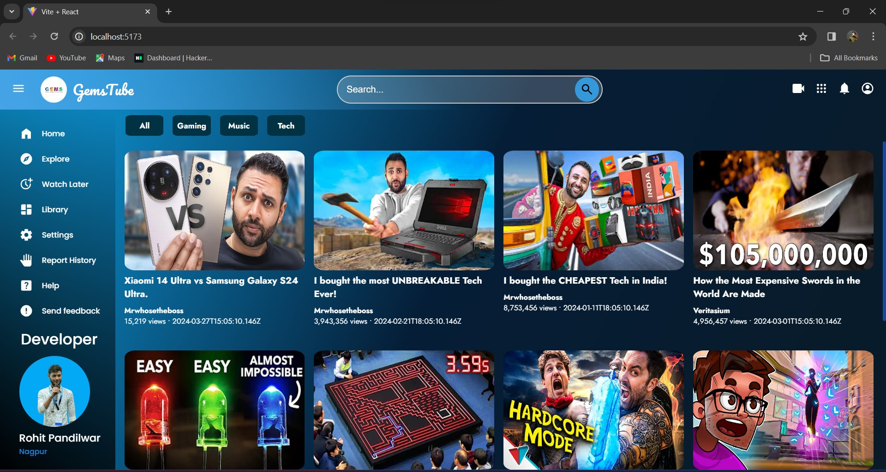
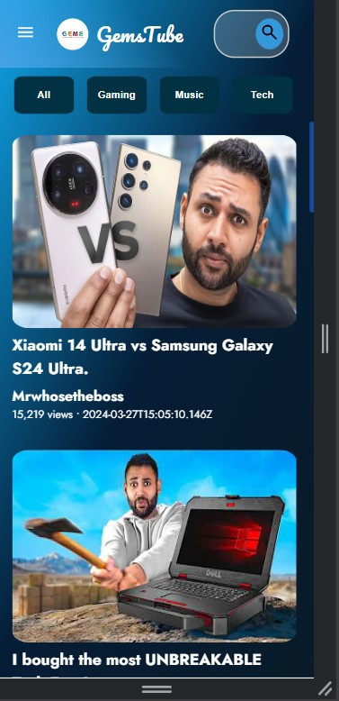

# GemsTube

🚀 Welcome to GemsTube!

## Overview
This Project is a responsive single page video streaming application.
Utilizes the API provided for task to fetch video recommendations for incorporation into the
webpage. It has interactive elements which demonstrates my
proficiency in frontend frameworks like React.
This Project is made with Vite + React

## Developer's note:
I tried fetching API endpoints with `fetch` and `axios` but due to console error stating :

*Access to XMLHttpRequest at 'https://ypapi.formz.in/api/public/videos' from origin 'http://localhost:5173' has been blocked by CORS policy: No 'Access-Control-Allow-Origin' header is present on the requested resource.*  

this API endpoint cant be accessed. I also tried using proxy but didnt worked.

I stringyfied API Endpoint manually into data.json file and used it locally while development.

## Screenshots

### Home Page
1. Desktop : 

2. Responsive Design :

### Installation

Follow these steps to set up and run the project locally:

1. Clone the repository:

`git clone https://github.com/R2932/GemsTube.git`

2. Navigate to the project directory:

`cd GemsTube`

3. Install dependencies:

`npm install`

4. Make sure:

data.json file is unchanged in the src folder

5. Start the development server:

`npm run dev`

## Technologies Used
- Vite
- React.js
- Node.js
- Tailwind CSS

## Contributing
1. Fork the repository.
2. Create a new branch (git checkout -b feature-name).
3. Make your changes.
4. Commit your changes (git commit -am 'Add new feature').
5. Push to the branch (git push origin feature-name).
6. Create a new Pull Request.

## Credits :
Author : Rohit Ajay Pandilwar

LinkedIn : [LinkedIn Profile](https://in.linkedin.com/in/rohit-pandilwar-059991234?trk=public_profile_browsemap)